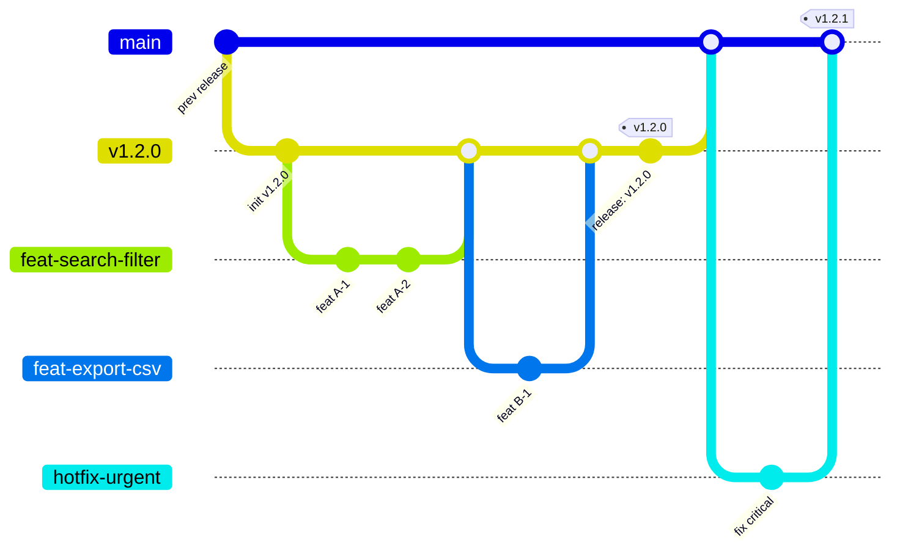
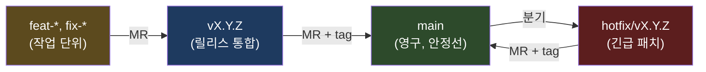
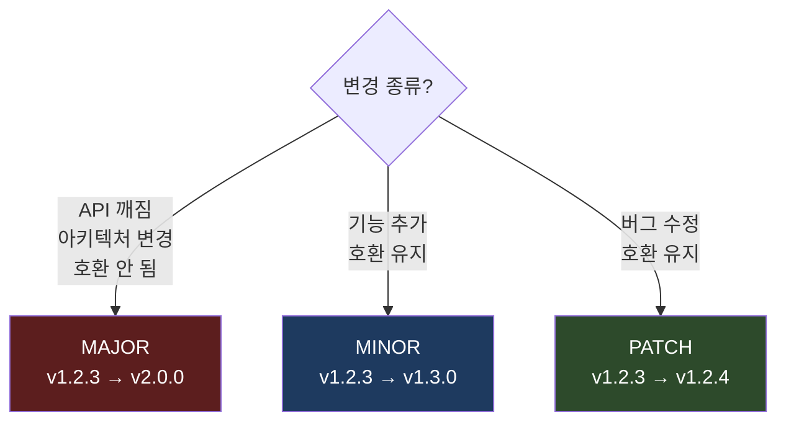
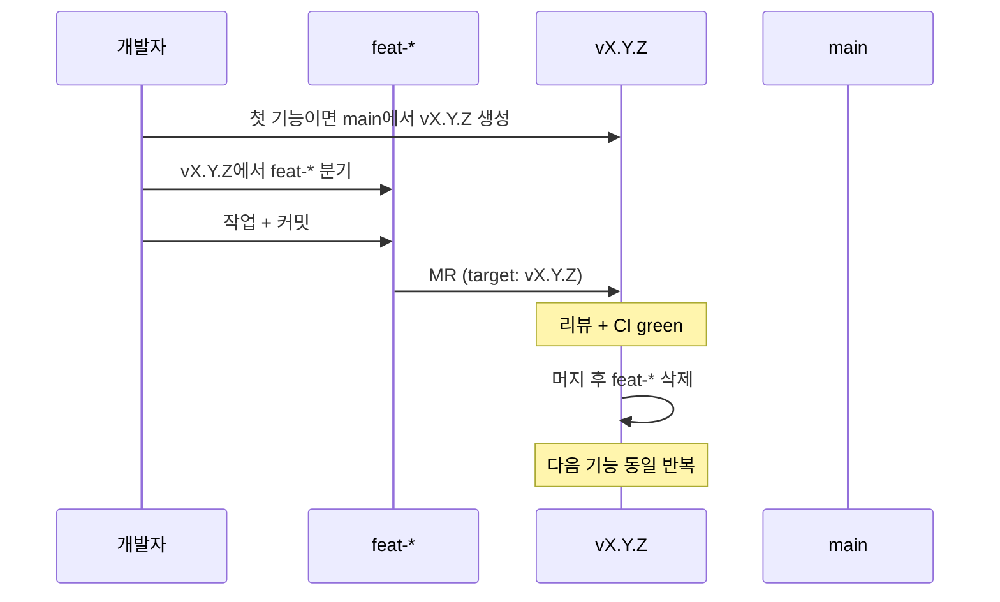
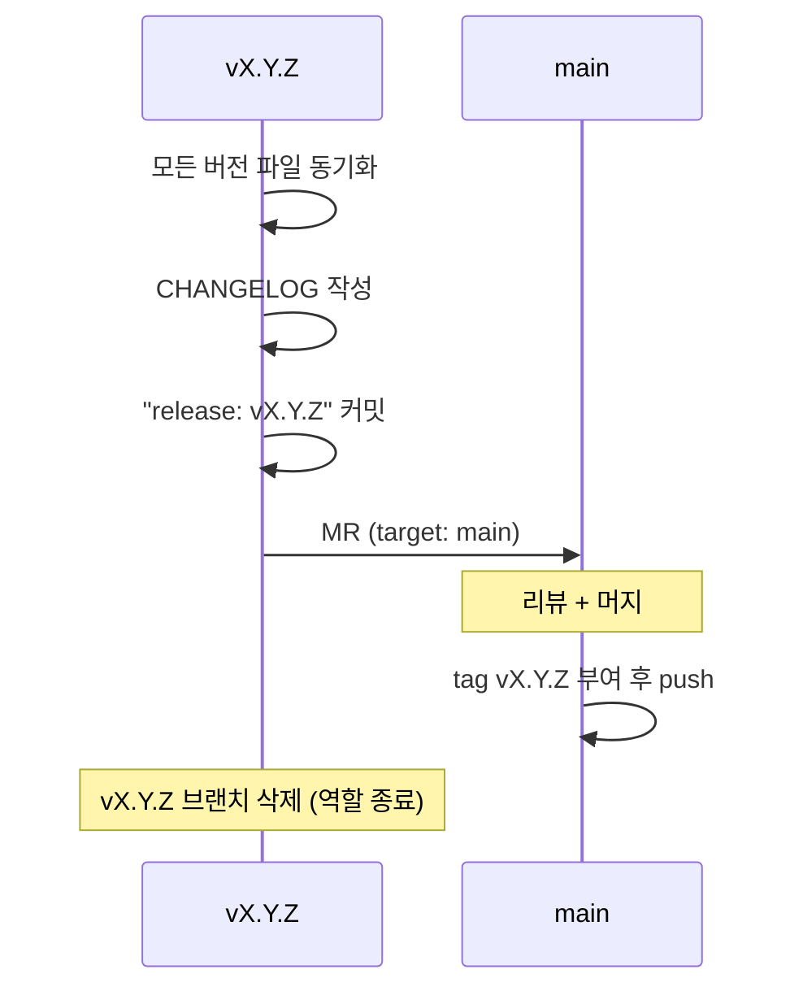
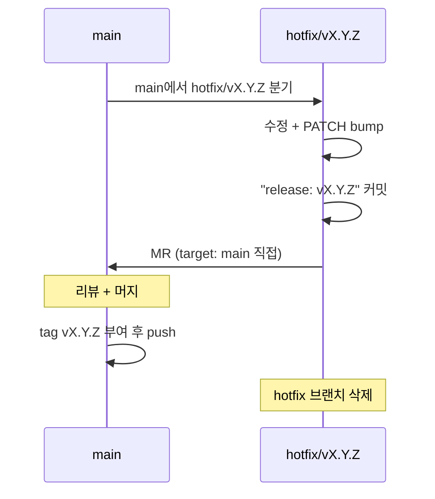
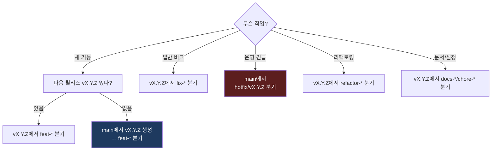

# 사내 브랜치 / 버전 / 커밋 컨벤션

> 사용 법 : 문서 하단 CLAUDE.md 를 각 프로젝트 루트에 셋팅. 기존 CLAUDE.md 존재시 통합

모든 사내 프로젝트에 적용하는 공통 표준.
프로젝트별 특이사항은 각 레포 CLAUDE.md / README에서 상속·확장.

---

## 1 한 줄 요약

`main` ← `vX.Y.Z`(릴리스 통합) ← `feat-*` / `fix-*`(작업 단위) 3계층.
**단일 main 모델 (production 브랜치 분리 X).**
**hotfix는 main 직접 분기·머지 허용.**
**머지된 작업/핫픽스 브랜치는 즉시 삭제.**
버전은 **SemVer**, 커밋은 **Conventional Commits**.

---

## 2 핵심 원칙: 단일 main 모델 (Trunk-Based)


### 2.1 사용하지 않는 패턴

- `production` 브랜치 분리 X
- `develop` 브랜치 분리 X
- `staging` 브랜치 분리 X
- 환경별 장수 브랜치 일절 운영 X

### 2.2 태그의 역할

태그는 **코드 버전 식별자**. 환경 매핑 도구가 아님.

- 태그 = 어느 시점의 main 상태인지 표시하는 영구 마커
- 어떤 태그를 어떤 환경에 올릴지는 *배포 시점의 운영 결정* (컨벤션 영역 밖)
- 환경별 태그 트랙(`-dev`, `-rc`, `-prod`) 만들지 않음 — `vX.Y.Z` 단일 형식만 유지

### 2.3 이유

| 항목 | 다중 브랜치 모델 | 단일 main 모델 (채택) |
|---|---|---|
| 브랜치 수 | main + production + develop + ... | main 1개 |
| 핫픽스 | 양쪽 cherry-pick 필요 | main 한 번 수정 → 태그 |
| 브랜치 drift | 시간 지날수록 벌어짐 | 없음 |
| 머지 충돌 | 자주 | 드물게 |
| 롤백 | 브랜치 reset 또는 revert | 이전 태그 checkout |
| 인지 부하 | 어느 브랜치가 무엇인지 추적 필요 | main 하나만 보면 됨 |

브랜치는 *작업 흐름*만 표현. 환경/배포 상태는 *태그와 배포 도구*가 표현.

---

## 3 전체 토폴로지



---

## 4 브랜치 종류



| 브랜치 | 출처 | 머지 대상 | 수명 | 보호 |
|---|---|---|---|---|
| `main` | — | — | 영구 | Protected, force-push 금지 |
| `vX.Y.Z` | `main` | `main` | 릴리스 완료까지 | Protected (선택) |
| `feat-*`, `fix-*` 등 | `vX.Y.Z` | `vX.Y.Z` | 작업 완료까지 | 비보호, 삭제 가능 |
| `hotfix/vX.Y.Z` | `main` | `main` 직접 | 즉시 | 비보호, 삭제 가능 |

### 4.1 원칙

- **main은 항상 배포 가능한 상태**. 깨진 코드 직접 push 금지
- **vX.Y.Z는 통합 브랜치**. 다음 릴리스의 모든 feat이 모임
- **feat-* 는 main 직접 MR 금지**. 반드시 vX.Y.Z 경유
- **hotfix만 main 직접 분기·머지 허용** (긴급 패치 즉시 배포 위함)

---

## 5 명명 규칙

### 5.1 릴리스 브랜치

```
v<MAJOR>.<MINOR>.<PATCH>
```

- 예: `v0.21.0`, `v1.0.0`, `v2.1.3`
- 소문자 `v` + SemVer 정확히 따름
- 동시 진행 1개만 (overlap 금지) — 병렬 진행 필요 시 다음 MAJOR/MINOR로 분리

### 5.2 작업 브랜치

```
<type>-<kebab-case-scope>
```

| Type | 의미 | 예시 |
|---|---|---|
| `feat-` | 기능 추가 | `feat-user-export`, `feat-snmp-v3` |
| `fix-` | 버그 수정 | `fix-login-timeout`, `fix-memory-leak` |
| `refactor-` | 리팩토링 (동작 변경 X) | `refactor-port-extraction` |
| `perf-` | 성능 개선 | `perf-query-batch` |
| `docs-` | 문서 | `docs-api-guide` |
| `chore-` | 빌드/설정/잡일 | `chore-upgrade-deps` |
| `test-` | 테스트 추가 | `test-integration-snmp` |

규칙:
- 슬래시 대신 하이픈 (`feat-foo`, NOT `feat/foo`, NOT `feature/foo`)
- 버전 prefix 포함 금지 (이미 vX.Y.Z 안에 있음)
- 영문 소문자 + 하이픈 (kebab-case)
- 너무 길지 않게 (3~5단어 권장)

### 5.3 핫픽스 브랜치

```
hotfix/v<MAJOR>.<MINOR>.<PATCH>
```

- 예: `hotfix/v1.2.1`
- 슬래시 사용 (일반 작업 브랜치와 시각적 구분 위함)
- 버전은 PATCH bump 한 값 (현재 운영 버전 + 1)

---

## 6 버전 관리 (SemVer)

### 6.1 Bump 규칙



| 종류 | 언제 | 예 |
|---|---|---|
| **MAJOR** (X) | 호환 깨는 변경 | API 응답 구조 변경, DB 스키마 호환 끊김 |
| **MINOR** (Y) | 기능 추가, 호환 유지 | 새 엔드포인트, 새 화면, 새 옵션 |
| **PATCH** (Z) | 버그 수정, 호환 유지 | 잘못된 계산 수정, 누락 처리, 보안 패치 |

### 6.2 v1.0.0 도달 전 (`0.x.y`)

- MINOR도 호환 깰 수 있음 (SemVer 공식 표준)
- 따라서 0.x 단계에서는 *MINOR도 신중하게 결정*
- 프로덕션 안정성 확보되면 `v1.0.0`로 승격

### 6.3 버전 동기화 지점

태그 생성 *전*에 프로젝트의 모든 버전 파일을 동일하게 맞춰야 함.

| 스택 | 버전 파일 |
|---|---|
| Gradle | `build.gradle` `version = '1.2.0'` |
| Maven | `pom.xml` `<version>1.2.0</version>` |
| Node | `package.json` `"version": "1.2.0"` |
| Python | `pyproject.toml` `version = "1.2.0"` |
| 기타 | `VERSION` 파일 또는 프로젝트 컨벤션 |

가능하면 CI에서 **태그와 버전 파일 일치 검증**(불일치 시 빌드 실패) 권장.

### 6.4 태그 규칙

- 형식: `v<MAJOR>.<MINOR>.<PATCH>` (소문자 v 필수)
- 정규식: `^v\d+\.\d+\.\d+$`
- pre-release/RC: 기본적으로 사용 안 함 (단순함 우선)
- 필요 시 `v1.2.0-rc1` 형식 허용하되 별도 규칙 추가 합의

---

## 7 워크플로

### 7.1 일반 기능 개발



### 7.2 릴리스 마무리



### 7.3 핫픽스 (운영 긴급)



핫픽스를 분리하는 이유: 진행 중인 `vX.Y.Z` 릴리스 대기 없이 즉시 PATCH 배포 가능.

---

## 8 커밋 메시지 (Conventional Commits)

### 8.1 형식

```
<type>(<scope>): <subject>

<body>

<footer>
```

- `type`, `subject`는 필수, `scope`/`body`/`footer`는 선택
- `subject`: 50자 이내, 명령형 (마침표 X)
- `body`: 한 줄당 72자 이내, *왜* 변경했는지 중심
- `footer`: 이슈/MR 참조, breaking change 명시

### 8.2 Type 목록

| Type | 의미 |
|---|---|
| `feat` | 기능 추가 |
| `fix` | 버그 수정 |
| `refactor` | 리팩토링 (동작 변경 X) |
| `perf` | 성능 개선 |
| `docs` | 문서만 변경 |
| `test` | 테스트만 변경 |
| `chore` | 빌드/설정/잡일 (의존성 업데이트 등) |
| `style` | 코드 포맷, 세미콜론 등 (로직 변경 X) |
| `ci` | CI 설정 변경 |
| `release` | 릴리스 커밋 (버전 bump + CHANGELOG) |

### 8.3 Scope (선택)

변경 범위. 프로젝트별로 자유롭게 (web, api, snmp, db, auth, …).

### 8.4 예시

```
feat(web): WebSocket wss 자동 매핑 추가

HTTPS 페이지에서 ws://로 호출 시 Mixed Content 차단되던 문제.
window.location.protocol을 검사해 wss/ws 동적 결정.
```

```
fix(snmp): collectIpInputMetrics OID column 수정

V17 마이그레이션 이후 column이 5→2, 6→3, 7→5로 변경되었으나
nmsim 측은 V9 기준 column 사용 → walk 결과 비어있음 → FAULT 유지
```

```
chore: pnpm 9.x 고정

pnpm v10 strict-builds로 esbuild 빌드 실패 회피
```

```
release: v1.2.0
```

### 8.5 Breaking Change

footer에 명시:

```
feat(api): 사용자 응답 구조 개편

BREAKING CHANGE: GET /users 응답이 배열 → { data, meta } 로 변경.
프론트는 응답 파싱 로직 수정 필요.
```

→ 반드시 **MAJOR bump**

---

## 9 MR 룰

| MR 종류 | source              | target   | 머지 방식                        |
| ----- | ------------------- | -------- | ---------------------------- |
| 작업    | `feat-*`, `fix-*` 등 | `vX.Y.Z` | merge commit (squash 선택)     |
| 릴리스   | `vX.Y.Z`            | `main`   | **merge commit (squash 금지)** |
| 핫픽스   | `hotfix/vX.Y.Z`     | `main`   | **merge commit (squash 금지)** |

### 9.1 Squash 정책

- **작업 MR**: squash 가능 (작은 커밋 다수를 1커밋으로 정리)
- **릴리스/핫픽스 MR**: squash 금지 — 어떤 작업이 어느 릴리스에 들어갔는지 히스토리 추적 가능해야 함

### 9.2 MR 본문 권장 템플릿

```
## 변경 내용
- 무엇이 바뀌었는가 (불릿)

## 변경 이유
- 왜 이 작업이 필요했는가

## 검증
- 어떻게 동작을 확인했는가 (테스트, 로그, 스크린샷)

## 영향 범위
- 다른 모듈/팀에 미치는 영향 (선택)
```

---

## 10 브랜치 삭제 정책

**머지 완료된 브랜치는 즉시 삭제**. stale 브랜치 누적 방지.

### 10.1 삭제 대상

| 브랜치 | 머지 후 |
|---|---|
| `feat-*`, `fix-*`, `refactor-*`, `chore-*` 등 작업 브랜치 | **즉시 삭제** |
| `hotfix/vX.Y.Z` | **즉시 삭제** |
| `vX.Y.Z` 릴리스 브랜치 | **릴리스 완료(main 머지+태그) 후 삭제** |

### 10.2 보존 대상

| 브랜치 | 보존 이유 |
|---|---|
| `main` | 영구 trunk |
| `vX.Y.Z` (활성 릴리스 윈도우) | 다음 릴리스 통합 진행 중 |

### 10.3 자동화

- GitLab MR 옵션 **"Delete source branch when merge request is accepted"** 기본 활성화
- 신규 프로젝트 생성 시 레포 기본값으로 설정 (Settings → Merge Requests)
- MR 생성자가 체크박스를 끄는 경우는 *명시적 보존 사유*가 있을 때만

### 10.4 로컬 브랜치 정리

원격 자동 삭제와 별개로 개발자 책임:

- 작업 완료 후 로컬 `feat-*` 삭제 권장
- 정기 정리 (예: 주 1회) 권장
- 강제 X (개인 워크플로 존중)

### 10.5 예외 보존 (드물게)

특정 브랜치를 백업/시연/포크 백업 목적으로 보존해야 할 경우:

- `archive/<original-name>` prefix로 rename
- 보존 사유를 commit message 또는 별도 문서에 명시
- 일반 작업 브랜치와 시각적으로 분리

---

## 11 빠른 결정 트리



---

## 12 금지 / 통일 사항

### 12.1 금지

- `main`에 직접 push (hotfix 머지 제외)
- `feat-*`를 `main`으로 직접 MR
- 핫픽스 외에 `main` 직접 분기
- 릴리스/핫픽스 MR squash 머지
- force-push to `main` 또는 `vX.Y.Z` (Protected)
- 태그 재사용 (한 번 부여한 `vX.Y.Z`는 영구)
- **`production`, `develop`, `staging` 등 환경별 장수 브랜치 신설** (단일 main 모델 위반)
- **머지 완료된 작업/핫픽스 브랜치 방치** (즉시 삭제 필수)

### 12.2 통일

- 작업 브랜치: `feat-`, `fix-`, `refactor-`, … (하이픈, slash 금지)
- 릴리스 브랜치: `vX.Y.Z` (소문자 v)
- 핫픽스 브랜치: `hotfix/vX.Y.Z` (슬래시)
- 태그: `vX.Y.Z` (소문자 v)
- 커밋: Conventional Commits

### 12.3 예외 처리

- 사내 표준과 충돌하는 외부 도구 강제 컨벤션이 있으면 *해당 레포 CLAUDE.md에 명시*하고 본 표준 우선순위를 하위로
- 레거시 레포 마이그레이션은 점진적 적용 (한 번에 강제 X)

---

## 13 신규 프로젝트 체크리스트

- [ ] `main` 브랜치 Protected 설정
- [ ] 태그 패턴 `v*` Protected 설정 (CI 변수 주입 시 필요한 경우)
- [ ] **GitLab MR 기본값: "Delete source branch when merge request is accepted" 활성화** (Settings → Merge Requests)
- [ ] **`production`/`develop`/`staging` 브랜치 만들지 않음** (단일 main 모델)
- [ ] 버전 파일 1곳 또는 동기화 규칙 결정 (`build.gradle` / `package.json` / …)
- [ ] CI에 태그-버전 일치 검증 추가 (가능한 경우)
- [ ] CHANGELOG.md 초기화 (Keep a Changelog 형식)
- [ ] 본 컨벤션을 README 또는 CONTRIBUTING.md에 링크

---

## 14 참고

- [SemVer 2.0.0](https://semver.org/)
- [Conventional Commits 1.0.0](https://www.conventionalcommits.org/)
- [Keep a Changelog](https://keepachangelog.com/)

---

## 15 CLAUDE.md 통합 가이드

### 15.1 사용법

각 프로젝트 루트의 `CLAUDE.md`에 아래 블록을 그대로 복붙.

- 기존 `CLAUDE.md`가 없으면 → 신규 생성
- 기존 `CLAUDE.md`가 있으면 → `[REQUIRED]` 분류 안에 통합

### 15.2 통합 시 충돌 처리

| 상황 | 처리 |
|---|---|
| 기존 CLAUDE.md에 다른 브랜치 규칙 존재 (예: `feature/` slash) | 사내 표준이 우선. 기존 규칙 삭제 |
| 외부 도구 강제로 사내 표준과 충돌 (예: Heroku의 `production` 브랜치 강제) | 해당 항목만 override 명시 + 사유 기록 |
| 기존 CLAUDE.md에 SemVer/커밋 규칙 존재 | 사내 표준 블록으로 교체 (중복 제거) |
| 프로젝트 특이사항 (배포 명령, 환경별 설정) | 사내 표준과 별개 섹션으로 유지 |

### 15.3 갱신 시

사내 표준이 갱신되면 각 프로젝트 CLAUDE.md를 동기화. 갱신 빈도가 낮으므로 수동 동기화로 충분.

---

## 16 CLAUDE.md 복붙 블록

아래 내용을 그대로 프로젝트 루트 `CLAUDE.md`에 붙여넣기.

````markdown
## [REQUIRED] 브랜치/버전/커밋 규칙 (사내 표준)

### 토폴로지 (단일 main 모델)

```
main ← vX.Y.Z (릴리스 통합, short-lived) ← feat-*, fix-* 등 (작업 단위)
hotfix/vX.Y.Z → main 직접 머지 (긴급 패치 예외)
```

- **단일 main 모델**: `production`/`develop`/`staging` 등 환경별 장수 브랜치 신설 금지
- 태그(`vX.Y.Z`)는 **코드 버전 식별자**. 브랜치는 *작업 흐름*만 표현
- `feat-*` 는 `main` 직접 MR 금지. 반드시 `vX.Y.Z` 경유
- `hotfix/vX.Y.Z` 만 `main` 직접 분기·머지 허용

### 브랜치 명명

| 종류 | 형식 | 예 |
|---|---|---|
| 릴리스 통합 | `vX.Y.Z` | `v0.21.0` |
| 작업 | `<type>-<kebab-case>` | `feat-topology-layout`, `fix-snmp-timeout` |
| 핫픽스 | `hotfix/vX.Y.Z` | `hotfix/v0.20.7` |

Type: `feat`, `fix`, `refactor`, `perf`, `docs`, `chore`, `test`, `style`, `ci`

규칙:
- 작업 브랜치는 **하이픈** (`feat-foo`), slash 금지 (`feature/foo` 금지)
- 작업 브랜치명에 버전 prefix 금지 (이미 `vX.Y.Z` 안에 있음)
- 릴리스/핫픽스만 슬래시 (`hotfix/vX.Y.Z`)

### 버전 (SemVer)

| Bump | 언제 | 예 |
|---|---|---|
| MAJOR | API 깨짐, 아키텍처 변경, 호환 안 됨 | v1.2.3 → v2.0.0 |
| MINOR | 기능 추가, 호환 유지 | v1.2.3 → v1.3.0 |
| PATCH | 버그 수정, 호환 유지 | v1.2.3 → v1.2.4 |

- 태그 형식: `vX.Y.Z` (소문자 v), 정규식 `^v\d+\.\d+\.\d+$`
- 태그 부여 전 모든 버전 파일 동기화 (`build.gradle`, `package.json`, `pyproject.toml` 등)
- v1.0.0 도달 전(`0.x.y`)은 MINOR도 호환 깰 수 있음 (SemVer 표준)
- 태그 재사용 금지 (한 번 부여한 `vX.Y.Z`는 영구)

### 커밋 (Conventional Commits)

형식:

```
<type>(<scope>): <subject>

<body>

<footer>
```

- type: `feat`, `fix`, `refactor`, `perf`, `docs`, `test`, `chore`, `style`, `ci`, `release`
- subject: 50자 이내, 명령형, 마침표 없음
- body: 72자/줄, *왜* 변경했는지 중심
- breaking change: footer에 `BREAKING CHANGE: ...` 명시 → MAJOR bump 필수

예:

```
feat(web): WebSocket wss 자동 매핑 추가

HTTPS 페이지에서 Mixed Content 차단되던 문제 해소.
```

### 워크플로

- **일반**: `main`에서 `vX.Y.Z` 생성 → `vX.Y.Z`에서 `feat-*` 분기 → MR(target: `vX.Y.Z`) → 머지 → 다른 기능 반복 → 릴리스 시 버전 동기화 + CHANGELOG + `vX.Y.Z` → `main` MR → 머지 후 태그 부여
- **핫픽스**: `main`에서 `hotfix/vX.Y.Z` 분기 → 수정 + PATCH bump → MR(target: `main`) → 머지 후 태그 부여
- **릴리스 커밋 메시지**: `release: vX.Y.Z`

### MR 룰

| 종류 | source → target | 머지 방식 |
|---|---|---|
| 작업 | `feat-*` → `vX.Y.Z` | merge commit (squash 선택 가능) |
| 릴리스 | `vX.Y.Z` → `main` | **merge commit, squash 금지** |
| 핫픽스 | `hotfix/vX.Y.Z` → `main` | **merge commit, squash 금지** |

릴리스/핫픽스 squash 금지 이유: 어떤 작업이 어느 릴리스에 들어갔는지 히스토리 추적.

### 브랜치 삭제 정책

- 머지된 작업 브랜치(`feat-*`, `fix-*`, …) → **즉시 삭제**
- 머지된 핫픽스 브랜치 → **즉시 삭제**
- `vX.Y.Z` 릴리스 브랜치 → **`main` 머지 + 태그 후 삭제**
- GitLab MR "Delete source branch when merge request is accepted" 기본 활성화
- 로컬 브랜치 정리는 개발자 자율 (강제 X)

### 금지

- `main`에 직접 push (hotfix 머지 제외)
- `feat-*`를 `main`으로 직접 MR
- 핫픽스 외에 `main` 직접 분기
- 릴리스/핫픽스 MR squash 머지
- force-push to `main` 또는 `vX.Y.Z`
- 태그 재사용 (한 번 부여한 `vX.Y.Z`는 영구)
- `production`/`develop`/`staging` 등 환경별 장수 브랜치 신설
- 머지 완료된 브랜치 방치
- 작업 브랜치명에 slash 사용 (`feature/foo` 금지 → `feat-foo`)

### 빠른 결정

| 작업 | 브랜치 |
|---|---|
| 새 기능 (다음 릴리스 없음) | `main`에서 `vX.Y.Z` 생성 → `feat-*` 분기 |
| 새 기능 (다음 릴리스 진행 중) | `vX.Y.Z`에서 `feat-*` 분기 |
| 일반 버그 | `vX.Y.Z`에서 `fix-*` 분기 |
| 운영 긴급 버그 | `main`에서 `hotfix/vX.Y.Z` 분기 |
| 리팩토링 | `vX.Y.Z`에서 `refactor-*` 분기 |
````

---

## 17 통합 후 검증

CLAUDE.md 적용 후 Claude 세션에서 확인:

- [ ] 새 작업 시작 시 Claude가 올바른 브랜치명 제안 (`feat-foo`, NOT `feature/foo`)
- [ ] 커밋 메시지가 Conventional Commits 형식 따름
- [ ] 릴리스 시 SemVer bump 룰대로 버전 결정
- [ ] 환경별 장수 브랜치(`production` 등) 신설 요청 시 Claude가 거부
- [ ] 태그는 `vX.Y.Z` 단일 형식만 사용 (환경별 suffix 안 붙임)
